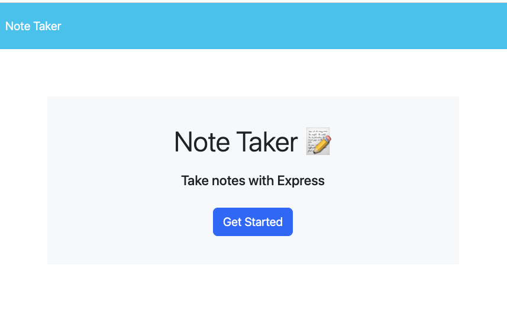

# Note Taker

## Description
A web application that can be used to write, save, and delete notes.

## Table of Contents
- [Installation](#installation)
- [URL](#url)
- [License](#license)
- [Contributing](#contributing)
- [Tests](#tests)
- [Questions](#questions)

## Installation
Just go to the website and get started! 

##  URL
It's very easy to use and self-explanatory on the [website](https://shielded-ocean-83265-9363e8fa431d.herokuapp.com).   

Here is a screenshot of the home page:  

## License

This project is licensed under the MIT license.

## Contributing
n/a

## Tests
n/a

## Questions
For questions, contact steve17rouse@gmail.com. Visit [GitHub](https://github.com/stever001).